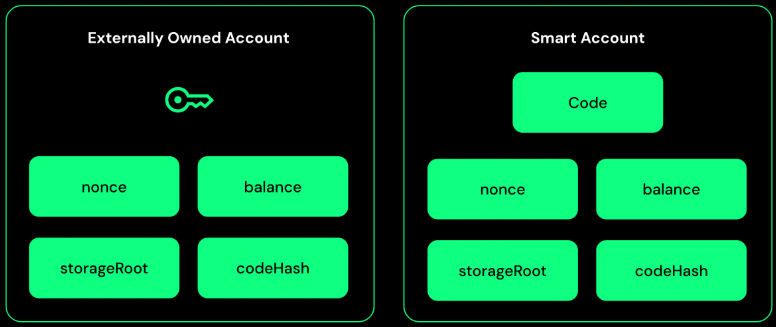

# 노시스(GNO) 체인 조사

# 노시스 체인

- 이더리움 네트워크 기반으로 구축된 레이어1 블록체인 네트워크
- 스마트 계약과 Dapp을 처리할 수 있음, PoS방식으로 전환
- 이더리움에서 노시스 체인으로 마이그레이션 분기 가능, 이더리움과 완전 호환

## 특징

- 고성능: 빠른 트랜잭션 처리 속도
- 스마트 계약 및 Dapp 지원: 고급 스마트 계약과 Dapp 실행 가능
- PoS방식

---

# EIP-712

- EIP-712: Ethereum Improvement Proposal
    - 구조화된 데이터에 서명
    - 사람이 내용을 확인 가능
    - 스마트 컨트랙트에서 해당 메세지를 재현하고 검증 가능

| 항목 | 기존 `eth_sign` | EIP-712 `eth_signTypedData` |
| --- | --- | --- |
| 데이터 구조 | 단순 문자열 or 바이트 해시 | 구조화된 JSON-like 구조 |
| 사람이 읽을 수 있나 | ❌ 불가능 | ✅ 가능 (지갑에 상세 표시됨) |
| 스마트 컨트랙트 검증 | ❌ 어려움 | ✅ 구조를 그대로 해시하여 검증 |
| 보안성 | ⚠️ 피싱에 취약 | ✅ 피싱 방지 |
| 표준성 | ❌ | ✅ (공식 EIP-712 표준) |
- **사용자가 명확하게 무엇에 서명하는지 확인 가능**
    
    → 메타마스크나 지갑에서 "보낼 주소", "금액", "메시지" 등을 보여줄 수 있음
    
- **스마트 컨트랙트와 동일한 방식으로 메시지를 해시하고 검증 가능**
    
    → 다중 서명 시스템, 탈중앙화 투표, 계약 승인을 위한 표준 수단
    
- **Replay 공격 방지 (nonce 포함)**
    
    → 이전 메시지를 복사해서 재사용하는 공격 불가

온체인 vs 오프체인 Multisig Ref

[https://shivanisb10.medium.com/multisig-contracts-in-ethereum-ffd8a1a9a025](https://shivanisb10.medium.com/multisig-contracts-in-ethereum-ffd8a1a9a025)

[https://www.paxos.com/blog/simple-multisig-how-it-works-and-why-its-awesome](https://www.paxos.com/blog/simple-multisig-how-it-works-and-why-its-awesome)
[https://www.krayondigital.com/blog/multisig-wallets-complete-guide-2024](https://www.krayondigital.com/blog/multisig-wallets-complete-guide-2024)

---

[https://docs.safe.global/advanced/smart-account-overview](https://docs.safe.global/advanced/smart-account-overview)

# Gnosis Safe

## 이더리움 계정 종류

### 1. 외부 소유 계정, EOAs(Externally Owned Accounts)

- 보통의 키쌍을 사용하는 이더리움 계정
- 하나의 개인 키로 트랜잭션을 발생시키고 서명 가능
- 해당 키를 소유한 사람이 완전한 제어권을 가짐 → 단일 실패 지점

### 2. 스마트 계정(Smart Accounts)

- 스마트 컨트랙트 계정
- 자금을 수신하고 트랜잭션을 발생시킬 수 있지만, 트랜잭션을 스스로 시작하지는 못함
- 단일 개인 키가 아닌 스마트 컨트랙트 코드가 트랜잭션 처리를 정의
    - 소유자, 서명 구조, 조건등의 로직으로 트랜잭션 실행 여부를 세부적으로 제어 가능

요약

| 항목 | EOA | 스마트 계정 |
| --- | --- | --- |
| 제어 수단 | 개인 키 1개 | 스마트 계약 로직 |
| 트랜잭션 실행 | 직접 가능 | 외부 호출 필요 |
| 보안 | 단일 실패 지점 | 복수 서명, 모듈, 가드 등 |
| 확장성 | 제한적 | 모듈화, 커스터마이징 가능 |

---

## Safe 스마트 계정

### 개념 및 특징[Concept]

다중 서명 기능을 핵심으로 하는 스마트 계정

보안성: 다중 서명 로직

유연성: 

- 모듈을 지원하여 다중 서명이외의 방식으로도 트랜잭션 실행 가능
- delegatecall 기능 지원: 다른 계약의 로직도 실행 가능

### 주요 기능[Features]

- 높은 보안성:
    - 다중 서명 기능, 소유자는 EOA, 다른 스마트 계약, Passkey 기반 계정 등이 될 수 있음
- 고급 실행 로직:
    - 배치 트랜잭션
- 세분화된 접근 제어:
    - 복구 모듈, 일일 한도 모듈, Passkey 모듈 등 추가 가능
- 토큰 콜백 지원
- 스폰서 트랜잭션

> 용어 정리
- 소유자: 트랜잭션 승인에 참여하는 사람
- 배치 트랜잭션: 여러 개의 이더리움 트랜잭션을 하나로 묶어서 실행하는 것, 한 번의 서명으로 여러 트랜잭션을 일괄 실행 가능
> 

### 아키텍처[Architecture]

1. Safe Singleton Factory: 이하의 모든 Safe 관련 계약을 배포하는 중앙 팩토리 계약, 네트워크 간 동일한 주소에 배포되도록 설계
https://github.com/safe-global/safe-singleton-factory
2. Safe Proxy Factory: 새로운 SafeProxy를 생성
3. Safe: 
    1. 세이프 프록시에서 delegate call을 통해 호출하는 싱글톤 계약
    2. 서명 검증, 트랜잭션 실행, 소유자 관리, 모듈 및 fallback handler 로직을 포함
    3. Safe 계정으로 직접 사용이 불가능 → Safe 프록시 계약을 통해서만 사용
        1. Safe
        2. SafeL2: L2 체인에서 사용

Safe 계약에는 다음의 계약들이 포함됨

1. Owner Management: 핵심 기능
    - 소유자 추가, 제거, 교체 기능 제공
    - 임계값 설정 및 수정 기능 제공
    - 소유자 목록 조회 기능
    - 위 상태 변화마다 이벤트 발생

1. Module Management: 추가 기능
    - Safe 핵심 기능 이외의 기능을 추가할 수 있음
    - Safe 핵심 계약과 분리되어 독립적 실행 가능
    - 모듈을 추가/제거하기 위해서는 소유자들의 임계값 만큼의 서명이 필요
    
    https://github.com/safe-global/safe-modules/tree/main/modules
    

1. Executor
    - 외부 주소에 대해 `call` , `delegatecall` 을 실행하는 로직

1. Fallback Manager
    - 스마트 계약의 크기 제한을 확장하도록 도와주는 기능
    - EVM은 스마트 계약의 크기를 24KB로 제한

1. Guard Management: 계약 체킹
    - Guard 트랜잭션 실행 여부를 체크(보안 검사)
    - Guard 업데이트 시마다 이벤트 발생

1. SafeProxy
    - 모든 호출을 Safe Singleton으로 delegate하는 계약
    - 프록시 서버와 유사
        - 다만, delegatecall은 실제 코드 실행이 위임 → 프록시 서버에서 실제 코드 실행
        - 각 프록시 마다 자신의 데이터(소유자, 논스, 모듈 등)를 저장

[gnosissafe protocol repo](https://github.com/safe-global/safe-smart-account/tree/main/contracts)